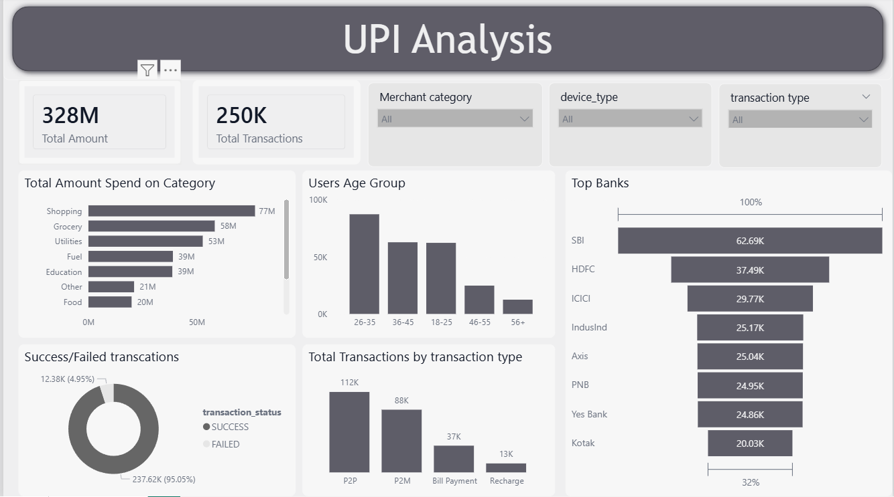
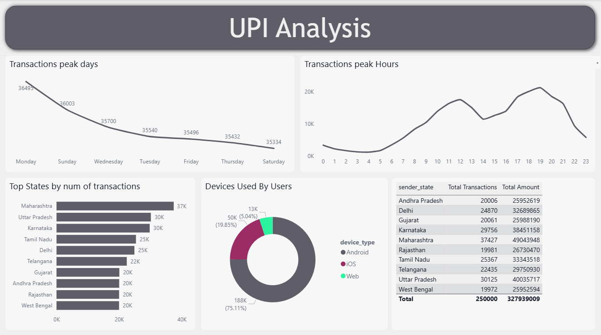

# UPI Analysis

This project is a UPI transactions analysis dashboard built with Microsoft Fabric and Power BI.

I cleaned the raw data in Microsoft Fabric, created a semantic model, connected it to Power BI Desktop, and built the final report. The report was then published to Power BI Service.

## Project Summary

This dashboard shows how UPI transactions behaved across amount, category, age group, bank, state, device type, transaction type, day, and hour.

It helps understand:

- Total amount and total transactions
- Which categories received the most spending
- Which age groups were most active
- Which banks, states, and devices were used the most
- When transactions peaked during the day and week
- Success vs failed transactions

## Published Report

- Power BI report: https://app.powerbi.com/view?r=eyJrIjoiNDFjNTkzN2UtYWQ0ZS00MTQxLTgzYWMtYzI3YzgzOWYwZDZhIiwidCI6ImY0MGYxYTgyLTUwMDItNDg3MC1iMzQ1LTc2ODlhZGUyZmQyZCJ9

## Screenshots

## Main Insights

- Total amount is around 328M and total transactions are around 250K.
- Shopping, grocery, and utilities are the top spending categories.
- The 26-35 age group is the most active.
- SBI, HDFC, and ICICI are the leading banks in the report.
- Most transactions are successful.
- P2P and P2M are the main transaction types.
- Monday and the evening hours show the highest activity.
- Maharashtra, Uttar Pradesh, Karnataka, and Tamil Nadu are among the top states.
- Android is the most used device type.

## Project Files

- `upi_transactions_2024.csv`
- `upi_analysis_report.pbix`
- `Custom Theme.json`
